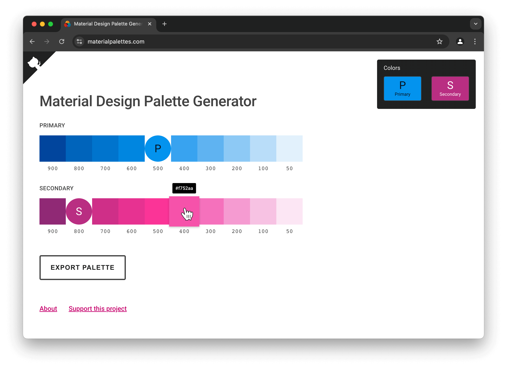
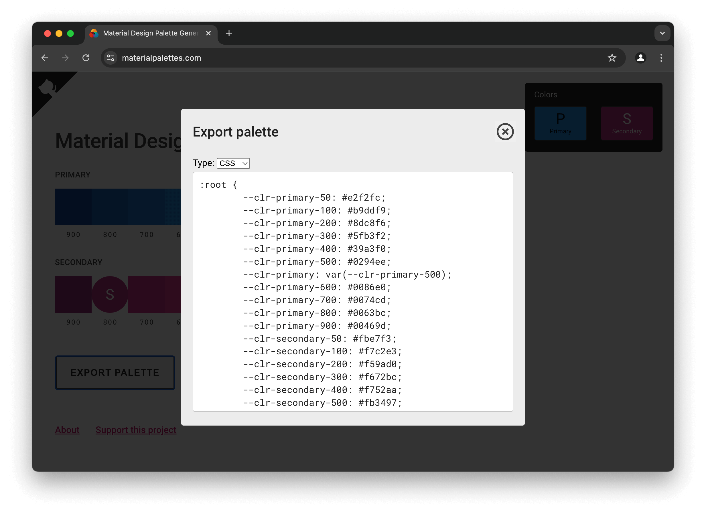

#  &nbsp;[Material Design Palette Generator](https://materialpalettes.com)

## What is this?

This is a (slightly modified) clone of the [official Material Design palette generator](https://material.io/design/color/the-color-system.html#tools-for-picking-colors). It does a few things:

1. Builds you a full color palette from a given hex color
1. Provides you with complementary colors based off your primary color
1. Allows you to export the palettes as JSON or CSS variables

Both are based on Material Design standards, and use Google's algorithm for color derivation.

## Why is this?

Google's official palette generator [is embedded and buried deep within the Material docs](https://material.io/design/color/the-color-system.html#tools-for-picking-colors). Since it's an inline tool, it's also hidden from search engines, making it difficult to discover or bookmark.

To make it a little easier to access and to preserve it for my own future use, I grabbed the obfuscated code (the original scripts do not appear to be public anywhere) and added some small interface improvements. I did _not_ change the way colors are derived.

## Plugins

- **Sketch:** After creating palettes and exporting the JSON data, Sketch users can create shared layer styles easily with the [Sketch JSON Color Palette Importer](https://github.com/ziyafenn/sketch-json-color-palette-importer) plugin.
- **VS Code:** Visual Studio Code users can take advantage of the [Material Design Palette Generator plugin](https://marketplace.visualstudio.com/items?itemName=piyush-bhatt.vscode-mat-palette), inspired by and based on this project.

## Support this project
This tool will always be free but your support is greatly appreciated.

- [Buy Me a Coffee](https://www.buymeacoffee.com/edelstone)
- [Venmo](https://venmo.com/michaeledelstone)
- [Cash App](https://cash.app/$edelstone)
- [Paypal](https://www.paypal.me/edelstone)

## Feedback and contributing
If you notice a problem or want a feature added please [file an issue on GitHub](https://github.com/edelstone/material-palette-generator/issues/new). You can also just [email me](mailto:contact@materialpalettes.com) the details.

If you're a developer and want to help with the project, please comment on [open issues](https://github.com/edelstone/material-palette-generator/issues) or create a new one. Once we agree on a path forward you can just make a pull request and take it to the finish line.

## Credits

- Hi, I'm [Michael Edelstone](https://michaeledelstone.com). You might also be interested in the [Tint & Shade Generator](https://maketintsandshades.com), another useful color tool I made.
- Most of this is copyright Google Inc. If you do anything with their code, please maintain the licenses they indicate at the top of the large files.
- You can use any of my modifications without credit, except...
- Favicon image courtesy of [Roundicons](https://roundicons.com/) and pulled from [flaticon.com](https://flaticon.com). If you reuse it, please continue to credit the creator.

Many thanks to [Ziya Fenn](https://github.com/ziyafenn) and [Mateusz Skórka](https://github.com/HotFr1dge) for their valuable contributions to this project.